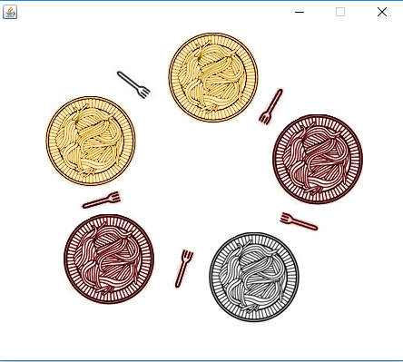

# Dining-Philosophers
[Dining Philosophers](https://en.wikipedia.org/wiki/Dining_philosophers_problem) problem implemented using Java with mutual exclusion and semaphores as a homework project for the course Operating Systems in Sabanci University where all the graphics elements and functions were provided beforehand.
(and note that barriers are implemented in addition the to problem itself for philosophers to wait each other to come to table before start dining).

This problem was first formulized by [Edsger Dijkstra](https://en.wikipedia.org/wiki/Edsger_W._Dijkstra) in 1965 to abstractly demonstrate problem with paralellity, concurrency, processors and resources.

On a circular table there are 5 philosophers with plates full of spagetti in front, and there is a fork between every plate, 5 in total.



Philosophers can be in three differrent states represented with three different plate colors:

* THINKING - black
* EATING - red
* HUNGRY - yellow

In order for a philosopher to eat, they need both of the forks to be available.

In the implementation of this problem there are several problems which can be overcomed by using semaphores and mutual exclution.

For example the problem can be approached with a simple algorithm where all philosophers represented with a thread:


```
while (true) {
  think();
  takeLeftFork();  //mutex(up)
  takeRightFork(); //mutex(up)
  eat();
  putRightFork();  //mutex(down)
  putLeftFork();   //mutex(down)
}
```
In this case, an unwanted result would occur when all the philosophers take the fork at their left at the same time.

Philosophers take the left fork and they wait for the right one to be available but since all the philosopher are circularly waiting for the same condition to happen, this would end up with a deadlock and starvation.

But instead we can test if the neighbors are eating or not everytime a philosopher tries to take a fork. This way philosophers would be prevented from altering thier states to EATING while both of the forks are not available. 
```
if (state[i] == HUNGRY && state[(i + 4) % 5] != EATING && state[(i + 1) % 5] != EATING) {
  state[i] = EATING;
  sem[i].release();
}
```
After eating and during putFork(), semaphore is used to signal neighbors who are in HUNGRY state and waiting a fork to be available.

### In Real Life...

...where multiple processes or programs need mutual access to the same resources, the same methods can be used in order to protect resources' credibility and maintain concurrency between processes.


